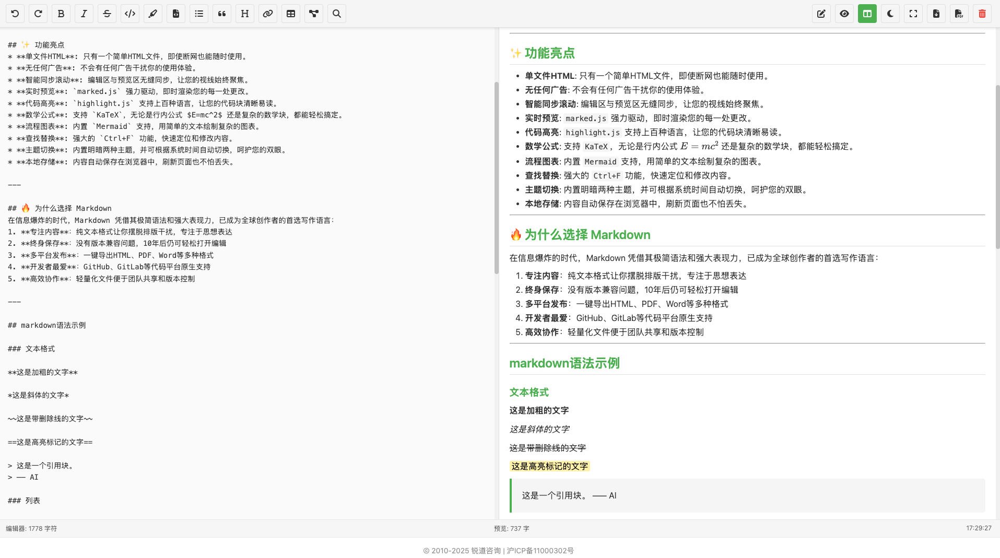

# Single-File-Markdown
# Mono-MD: 一个强大的单文件 Markdown 编辑器

一款极致简约、功能强大的在线 Markdown 编辑器。整个应用仅包含在一个 HTML 文件中，无需安装、无需服务器、无广告，打开即用。

**[➡️ 访问在线演示](https://md.iruidao.com/)** 

---

*(强烈建议您截一张编辑器界面的图片，命名为 `screenshot.png` 并上传到仓库根目录)*

## ✨ 核心理念：极致便携

在云服务和复杂构建工具盛行的时代，`Mono-MD` 回归本源。

* **单一文件**: 所有功能——HTML结构、CSS样式、JavaScript逻辑——都封装在 **一个 `index.html` 文件** 中。
* **离线可用**: 下载该文件到本地，即使在没有网络连接的飞机或高铁上，您也能随时随地进行创作。
* **绝对隐私**: 所有内容默认保存在您浏览器的本地存储中，不会上传到任何服务器。您的数据，只属于您。
* **轻松分享**: 想把这个编辑器分享给朋友？只需发送那个 HTML 文件即可。

## 🔥 功能特性

尽管极致简约，`Mono-MD` 在功能上毫不妥协：

* 🖋️ **实时预览**: `marked.js` 强力驱动，编辑与预览区同步滚动，所见即所得。
* 🎨 **主题切换**: 内置明/暗两种主题，并可根据系统时间自动切换，呵护您的双眼。
* 💻 **代码高亮**: `highlight.js` 支持上百种编程语言的语法高亮，代码块一目了然。
* 🧮 **数学公式**: 支持 `KaTeX`，无论是行内公式 $E=mc^2$ 还是复杂的数学块，都能完美渲染。
* 📊 **图表绘制**: 内置 `Mermaid.js`，让您用简单的文本绘制出专业的流程图、序列图等。
* 💾 **本地存储**: 您的创作会自动保存在浏览器中，刷新页面也不会丢失。
* 📥 **导出功能**: 可轻松将您的作品导出为 `.md` 文件或打印成 `.pdf`。
* 📱 **响应式设计**: 无论在桌面电脑还是移动设备上，都能获得良好的使用体验。
* 🔍 **查找替换**: 内置便捷的查找与替换功能，编辑长文更高效。
* 🚫 **纯净无扰**: 没有任何广告、弹窗或不必要的干扰。

## 🚀 如何使用

1.  **在线使用**: 直接访问上方的 **在线演示** 链接。
2.  **本地使用**:
    * 下载本仓库中的 `index.html` 文件。
    * 用您的浏览器（如 Chrome, Firefox, Edge）打开这个文件。
    * 开始写作！

## 🤝 贡献

欢迎任何形式的贡献！如果您有任何好的想法或建议，请随时提交

## 📄 授权协议

本项目基于 **Apache 2.0** 授权协议。详情请见 `LICENSE` 文件。
